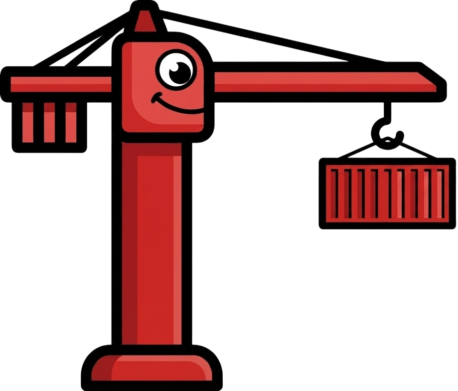

<div align="center">
  
</div>

<div align="center">

`grue` - **because S3 is all you need**


</div>

Why run a container registry when you already have a S3?

`grue` is a CLI that turns any S3-compatible bucket into a container registry. It pushes and pulls Docker images directly to and from object storage. You can use Cloudflare R2, AWS S3, MinIO, Backblaze B2, or another S3-compatible store. Authentication uses your S3 API keys.

The whole program is one file, `grue.go`, and under 1000 lines of code.

### Commands

- `grue connect` - configure an S3-compatible storage backend
- `grue push <name[:tag]>` - push a local image to the bucket
- `grue pull <name[:tag]>` - pull an image from the bucket into Docker
- `grue ls` - list repositories and tags
- `grue rm <name[:tag]>` - delete a tag, or all tags of a repository

### Usage

```bash
# Connect to S3
grue connect

# Push a local container image to your bucket
grue push my-image:1.2.3

# On another machine, pull it back
grue pull my-image:1.2.3

# The image appears in Docker
docker run my-image:1.2.3
```

Use env secrets:

```bash
GRUE_ACCESS_KEY=... grue push my-image:1.2.3
```

List what is in the bucket:

```bash
grue ls
```

Delete a tag:

```bash
grue rm my-image:old
```

Delete all tags of a repository:

```bash
grue rm my-image
```

### Configuration

Environment variables take priority over the config file.

| Variable          | Purpose                      |
|-------------------|------------------------------|
| `GRUE_ENDPOINT`   | S3 endpoint URL              |
| `GRUE_REGION`     | Region                       |
| `GRUE_ACCESS_KEY` | Access key                   |
| `GRUE_SECRET_KEY` | Secret key                   |
| `GRUE_BUCKET`     | Bucket name                  |
| `GRUE_PREFIX`     | Key prefix (default `grue/`) |
| `GRUE_CONFIG`     | Path to the config file      |

The config file is at `~/.config/grue/config.json` by default. Override the path with `GRUE_CONFIG`.

### GitHub Action

The grue action builds a Docker image and pushes it to your S3 bucket. You do not need a container registry.

Replace `docker/build-push-action` with the grue action. Then add your S3 credentials.

**Before** — push to a registry:
```yaml
- uses: docker/build-push-action@v7
  with:
    context: .
    tags: myimage:latest
    push: true
```

**After** — push to S3:
```yaml
- uses: Simple-Observability/grue@v1.0.0
  with:
    context: .
    tags: myimage:latest
    endpoint: ${{ secrets.GRUE_ENDPOINT }}
    bucket: ${{ secrets.GRUE_BUCKET }}
    access-key: ${{ secrets.GRUE_ACCESS_KEY }}
    secret-key: ${{ secrets.GRUE_SECRET_KEY }}
```

The grue action uses [`docker/build-push-action`](https://github.com/docker/build-push-action) to build the image. All build inputs (`build-args`, `target`, `cache-from`, `cache-to`, `platform`, and more) are sent to it directly. See [their inputs list](https://github.com/docker/build-push-action#inputs) for the full set.

#### Grue inputs

These inputs control the S3 connection and the grue binary. Build inputs are the same as `docker/build-push-action`.

| Input          | Description                                | Default     |
|----------------|--------------------------------------------|-------------|
| `tags`         | Image refs to push, one per line           | **required**|
| `endpoint`     | S3 endpoint URL                            |             |
| `region`       | S3 region                                  |             |
| `bucket`       | S3 bucket name                             |             |
| `prefix`       | Key prefix in the bucket (default `grue/`) |             |
| `access-key`   | S3 access key                              |             |
| `secret-key`   | S3 secret key                              |             |
| `grue-version` | grue binary version, from GitHub releases  | `latest`    |

### Limitations

- **No blob garbage collection.** `rm` deletes tags only; the blobs they referenced are retained. A future `gc`/`prune` command is planned.
- **One platform per tag.** The action builds one platform at a time. grue stores one image per tag. There is no multi-arch index.